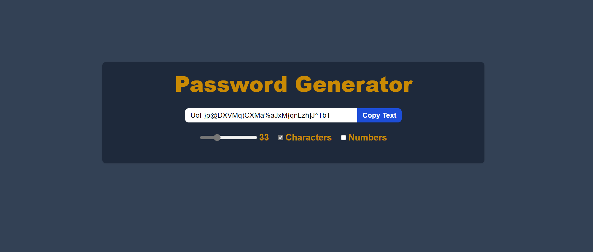

# Password Generator

## Description

Generate secure, customizable passwords with ease! This ReactJS application offers a user-friendly interface to create passwords tailored to your needs.



## Technologies Used

- ReactJS (v18.2.0)
- Vite (v3.1.0)
- Tailwind CSS (v3.2.4)

## Setup and Usage

1. Clone the repository

``` bash
git clone https://github.com/Kushal1605/Full-Stack-Development-Projects/password-generator.git
```

2. Install Dependencies

``` bash
npm install
```

3. Start the development server

``` bash
npm run dev
```

4. Access the application in your browser at <http://localhost:5173/>

